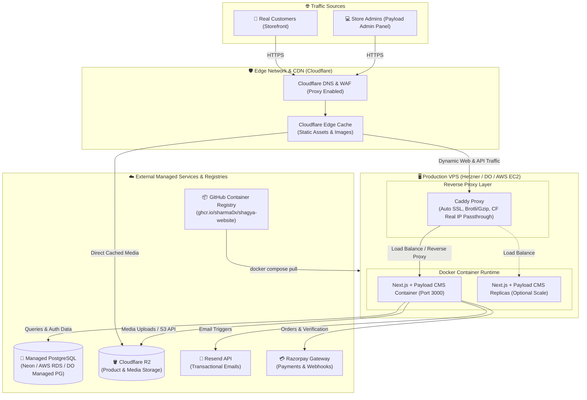

# High-Scale Production Deployment Guide

**Stack:** Next.js 16 + Payload CMS 3.x (Node.js 22), Managed PostgreSQL, Caddy Reverse Proxy, Cloudflare R2 (Media), GitHub Container Registry (`ghcr.io`).

This architecture decouples the database, persistent object storage, and compute runtime. The Next.js / Payload application runs inside containerized environments pulled directly from **GitHub Container Registry (GHCR)**, fronted by **Caddy** for automated TLS, Brotli/Gzip compression, and Cloudflare proxy support.

---

## 1. Architecture Overview



---

## 2. Infrastructure Requirements

| Component               | Minimum Specification                                                   | Recommended Providers                                                                 |
| :---------------------- | :---------------------------------------------------------------------- | :------------------------------------------------------------------------------------ |
| **Production VPS**      | 2 to 4 vCPUs, 4GB to 8GB RAM, 40GB+ SSD, Ubuntu 22.04 / 24.04 LTS       | Hetzner Cloud (CX32/CPX31), DigitalOcean Droplet, AWS EC2 (`t4g.medium`/`c7g.medium`) |
| **Managed Database**    | PostgreSQL 18-compatible, Connection Pooling enabled, automated backups | Neon, AWS RDS (`db.t4g.small`), DigitalOcean Managed PostgreSQL                       |
| **Object Storage**      | S3-compatible, zero egress fees                                         | Cloudflare R2                                                                         |
| **Container Registry**  | OCI Container Registry                                                  | GitHub Packages (`ghcr.io`)                                                           |
| **DNS & Edge WAF**      | Free / Pro tier with SSL mode **Full (Strict)**                         | Cloudflare                                                                            |
| **Transactional Email** | Dedicated SMTP/REST API                                                 | Resend                                                                                |

---

## 3. Automated CI/CD & Image Versioning Pipeline

Every commit to `develop` or `main` executes an automated GitHub Actions pipeline:

1. **Lint, Test & Build ([`.github/workflows/ci.yml`](file:///Users/princesharma74/Documents/Freelancing/Shagya/shagya-website/.github/workflows/ci.yml))**: Validates code formatting, ESLint, TypeScript types, unit tests, and production build on pull requests and branch pushes.
2. **Semantic Release ([`.github/workflows/release.yml`](file:///Users/princesharma74/Documents/Freelancing/Shagya/shagya-website/.github/workflows/release.yml))**: On `main` branch pushes, analyzes conventional commits (`feat:`, `fix:`, etc.), bumps version in `package.json`, generates `CHANGELOG.md`, and creates git release tags (e.g. `v1.0.0`).
3. **Docker Build & Push to GHCR ([`.github/workflows/docker-publish.yml`](file:///Users/princesharma74/Documents/Freelancing/Shagya/shagya-website/.github/workflows/docker-publish.yml))**: Compiles optimized production container images and publishes them to `ghcr.io/sharma0x/shagya-website` with appropriate tags:
   - **`develop` branch push**: tagged `:develop`, `:sha-<short-sha>`
   - **`main` release tag (`v*.*.*`)**: tagged `:v1.0.0`, `:1.0.0`, `:1.0`, `:1`, `:latest`, `:sha-<short-sha>`
   - **Manual dispatch**: tagged `:<custom_tag>` (defaults to `:testing`)
   - **Local build/push**: via `make ghcr-build-push TAG=testing`

---

## 4. First-Time VPS Setup (10 Minutes)

### Step 1: Install Docker & Docker Compose on VPS

Run on your clean Ubuntu VPS:

```bash
# Update packages
sudo apt update && sudo apt upgrade -y

# Install Docker, Compose & Make
sudo apt install -y ca-certificates curl gnupg make
sudo install -m 0755 -d /etc/apt/keyrings
curl -fsSL https://download.docker.com/linux/ubuntu/gpg | sudo gpg --dearmor -o /etc/apt/keyrings/docker.gpg
sudo chmod a+r /etc/apt/keyrings/docker.gpg

echo \
  "deb [arch=$(dpkg --print-architecture) signed-by=/etc/apt/keyrings/docker.gpg] https://download.docker.com/linux/ubuntu \
  $(. /etc/os-release && echo "$VERSION_CODENAME") stable" | \
  sudo tee /etc/apt/sources.list.d/docker.list > /dev/null

sudo apt update
sudo apt install -y docker-ce docker-ce-cli containerd.io docker-buildx-plugin docker-compose-plugin

# Allow current user to run docker without sudo
sudo usermod -aG docker $USER
newgrp docker
```

### Step 2: Clone or Copy Deployment Files to VPS

Create an application directory on the VPS (e.g. `/opt/shayga`):

```bash
mkdir -p /opt/shayga && cd /opt/shayga

# Clone repository
git clone https://github.com/sharma0x/shagya-website.git .
```

_(Alternatively, you only need `docker-compose.prod.yml`, `Caddyfile`, `Makefile`, and `.env.production` on the VPS)._

### Step 3: Authenticate with GitHub Container Registry

If the GHCR package is private, generate a GitHub Personal Access Token (Classic) with `read:packages` scope, then log in:

```bash
echo "<YOUR_GITHUB_PAT>" | docker login ghcr.io -u "<YOUR_GITHUB_USERNAME>" --password-stdin
```

_(Or run `make prod-login` with `GH_TOKEN` set in your terminal environment)._

### Step 4: Configure Production Environment Variables

Copy `.env.production.example` to `.env.production`:

```bash
cp .env.production.example .env.production
nano .env.production
```

Fill in your actual production credentials:

```env
# =============================================================================
# Shayga Production Environment Configuration
# =============================================================================
NODE_ENV=production
PORT=3000
DOMAIN_NAME=shayga.in
NEXT_PUBLIC_SERVER_URL=https://shayga.in

# Image Tag to Deploy (e.g. latest, v1.0.0, sha-xxxx)
IMAGE_TAG=latest
DOCKER_IMAGE=ghcr.io/sharma0x/shagya-website

# Managed Database Connection (Neon / RDS PostgreSQL 18)
DATABASE_URL=postgresql://neondb_owner:<password>@ep-xxxx.aws.neon.tech/neondb?sslmode=require

# Encryption Secrets (Generate via: openssl rand -base64 32)
PAYLOAD_SECRET=your_32_char_payload_secret_key_here
BETTER_AUTH_SECRET=your_32_char_better_auth_secret_key_here

# Cloudflare R2 Media Storage
R2_BUCKET=shayga-media
R2_ENDPOINT=https://<account_id>.r2.cloudflarestorage.com
R2_ACCESS_KEY_ID=<your_r2_access_key>
R2_SECRET_ACCESS_KEY=<your_r2_secret_key>
R2_REGION=auto

# Transactional Email (Resend)
RESEND_API_KEY=re_xxxxxxxxxxxxxxxxxxxx
EMAIL_FROM_NAME=Shayga
EMAIL_FROM_ADDRESS=orders@shayga.in

# Payments (Razorpay)
RAZORPAY_KEY_ID=rzp_live_xxxxxxxxxxxx
RAZORPAY_KEY_SECRET=your_live_razorpay_secret
```

---

## 5. Deployment Commands (Make Targets)

The deployment workflow is fully automated via `make`:

```bash
# 🚀 1-Click Deployment (Pulls latest image, runs database migrations, starts containers)
make prod-deploy

# Or deploy a specific released version:
make prod-deploy IMAGE_TAG=v1.0.0

# 📊 Check live logs
make prod-logs

# 🛑 Stop all production services
make prod-down

# 🔄 Restart all production services
make prod-restart

# 📦 Pull only the Docker image
make prod-pull IMAGE_TAG=v1.0.0

# 🗄️ Run migrations only
make prod-migrate
```

---

## 6. Cloudflare & Domain Configuration

1. **DNS Records**:
   - In your Cloudflare DNS dashboard, create:
     - `A` record for `shayga.in` pointing to your VPS Public IPv4 address (`Proxied` / 🟧 Orange Cloud enabled).
     - `CNAME` record for `www.shayga.in` pointing to `shayga.in` (`Proxied` enabled).
2. **Cloudflare SSL / TLS Mode**:
   - Go to **SSL/TLS** in Cloudflare.
   - Set encryption mode to **Full (Strict)** or **Full**.
   - Caddy will automatically negotiate SSL with Let's Encrypt / Cloudflare Edge and restore real client IPs via `CF-Connecting-IP`.

---

## 7. Zero-Downtime Rollback & Maintenance

### Rollback to a Previous Version

If a bug occurs in production, roll back to any historical image version in seconds:

```bash
make prod-deploy IMAGE_TAG=v0.9.8
```

### Database Seeding on Production (One-Time / Optional)

To download seed assets and populate initial collections on a fresh production database:

```bash
make seed-production
```

_(Requires `infra/.env.production` present locally or run directly on the VPS)._

### Monitoring & Health Checks

- Docker health check runs automatically every 15 seconds against `/api/users`.
- View live container status:

```bash
docker compose -f docker-compose.prod.yml ps
```
